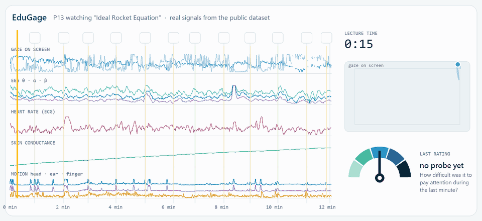
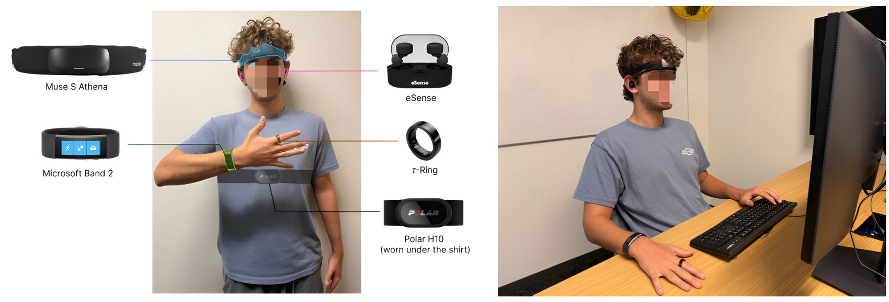

<div align="center">


### A Multimodal Dataset and Benchmark for Sensor-Based Momentary Assessment of Engagement in Self-Guided Video Learning

**[Zikang Leng](https://zikangleng.github.io/)\*, Edan Eyal\*, Yingtian Shi, Jiaman He, Yaqi Liu, [Thomas Plötz](https://ploetzlab.net/)**
<br>Georgia Institute of Technology · RMIT University · \*equal contribution

**Proceedings of the ACM on Interactive, Mobile, Wearable and Ubiquitous Technologies (IMWUT), Vol. 10, No. 4, 2026**

[](https://zikangleng.github.io/edugage/)
[](https://arxiv.org/abs/2605.01238)
[](https://arxiv.org/abs/2605.01238)
[](https://doi.org/10.6084/m9.figshare.32145994)



<sub>A real session from the released dataset. Signals scroll in sync with the lecture, and each coloured marker is the learner's own answer to <i>“How difficult was it to pay attention during the last minute?”</i></sub>

</div>

**Nobody notices when attention slips during a recorded lecture.** EduGage asks whether wearable and camera-based sensing can.
- Sixteen students each watched four short MIT lectures while wearing six sensing devices.
- About once a minute the video paused, and they rated how hard it had been to pay attention.
- We release every synchronised signal and every rating, and benchmark fifteen models on them under a participant-independent protocol.

<table align="center">
<tr>
<td align="center"><b>16</b><br>learners</td>
<td align="center"><b>64</b><br>lecture videos watched</td>
<td align="center"><b>699</b><br>in-situ ratings</td>
<td align="center"><b>~12 h</b><br>synchronised recordings</td>
<td align="center"><b>11</b><br>sensor streams from 6 devices</td>
</tr>
</table>

## The dataset



| Device | Worn on | Streams | Sampling rate |
|---|---|---|---|
| Muse S Athena | Head | EEG · PPG · IMU | 256 · 64 · 52 Hz |
| eSense | Ear | IMU | 50 Hz |
| Polar H10 | Chest | ECG | 130 Hz |
| Microsoft Band 2 | Wrist | EDA · heart rate | 5 · 2 Hz |
| τ-Ring | Finger | PPG · IMU · temperature | 25 Hz |
| Beam Eye Tracker | Webcam (Logitech Brio 101) | Gaze | 30 Hz |

**Label.** Each label is the participant's answer to *“How difficult was it to pay attention during the last minute of the lecture?”* on a 1–5 scale:
- 1 means attention was completely automatic and effortless.
- 5 means a heavy, conscious struggle to keep up.
- An **X** marks an external distraction; those probes are excluded.

Probes were placed at natural pauses in the lecture, about once a minute. Each prediction sample is the 44 s of sensor data before a probe.

**Lectures.** There are eight MIT Open Learning videos, two each on X-rays, aerospace engineering, environmental science and business. Each participant watched four, in an order set by a Williams design.

**Quizzes.** Quizzes before and after the last two lectures give a video-level check on the probe. Lectures rated harder had smaller learning gains (Pearson *r* = −0.75, *p* = 0.031, *n* = 8).

The **raw dataset (3.05 GB, CC BY 4.0)** is on [Figshare](https://doi.org/10.6084/m9.figshare.32145994). It has one folder per participant with cleaned public IDs, plus the quiz questions, de-identified quiz responses and the study materials.

## Benchmark

Participant-grouped 4-fold cross-validation: each model is always tested on people it has never seen. The table shows mean ± SD over folds and one representative per family; the paper has all fifteen models.

| Model | MAE ↓ | Within-1 acc. (%) ↑ | Binary acc. (%) ↑ | Binary macro-F1 (%) ↑ |
|---|:---:|:---:|:---:|:---:|
| Peer window mean (sensor-free) | 1.05 ± 0.12 | 53.47 ± 4.24 | 63.49 ± 8.01 | 50.84 ± 5.31 |
| Random Forest | 1.02 ± 0.16 | 76.37 ± 9.38 | 58.71 ± 13.44 | 55.68 ± 12.79 |
| DeepConvLSTM + self-attention | 0.96 ± 0.29 | 78.07 ± 10.95 | 66.81 ± 12.26 | 58.37 ± 14.89 |
| Foundation-model embeddings + linear head | 1.50 ± 0.12 | 54.19 ± 2.90 | 53.83 ± 4.82 | 51.26 ± 3.99 |
| LLM few-shot | 1.39 ± 0.35 | 60.14 ± 15.92 | 49.72 ± 12.25 | 43.47 ± 12.47 |
| **Modality-aware model** | **0.80 ± 0.20** | **83.18 ± 6.78** | **70.96 ± 10.17** | **62.90 ± 8.84** |

For the binary metrics, ratings 1–2 count as lower and 3–5 as higher attention difficulty.

**Further findings:**
- **Fewer sensors can be enough.** Across all 2,047 stream combinations, smaller sets match or beat the full set on some metrics. Chest ECG alone gives the best binary macro-F1 (70.54%), and five streams give the best within-1 accuracy (85.86%).
- **Where you measure the heart matters.** Chest ECG beats wrist heart rate, head PPG and finger PPG.
- **Ratings are persistent.** A one-minute forecast is about as accurate as estimating the current rating. Simply repeating the last rating is better still.

The [project page](https://zikangleng.github.io/edugage/) has interactive versions of all of these, plus session replays from the dataset.

## Quick start

### 1. Set up Python

```bash
python -m venv .venv
source .venv/bin/activate          # Windows PowerShell: .venv\Scripts\Activate.ps1
python -m pip install --upgrade pip
python -m pip install -r requirements.txt
```

### 2. Download the raw data

Open the [Figshare dataset page](https://doi.org/10.6084/m9.figshare.32145994), click **Download all**, extract the archive, and put the participant folders under `data/`. The `data/` directory is ignored by Git.

```text
EduGage/
  data/
    P1/
      1_1_engagement_log.csv
      1_1_EEG.csv
      1_1_ACC.csv
      ...
    P2/
      ...
```

The files are raw collection outputs, not cleaned, aligned or windowed products. Each participant/session folder contains one required experiment log and any available modality files with the same `<participant_id>_<session_id>` prefix:

```text
<participant_id>_<session_id>_engagement_log.csv      (required)
<participant_id>_<session_id>_EEG.csv                 Muse EEG
<participant_id>_<session_id>_ACC.csv / _GYRO.csv     Muse IMU
<participant_id>_<session_id>_PPG.csv                 Muse PPG
<participant_id>_<session_id>_Polar_ECG.csv           Polar H10 ECG
<participant_id>_<session_id>_msband_gsr.csv          Microsoft Band EDA
<participant_id>_<session_id>_msband_hr.csv           Microsoft Band heart rate
<participant_id>_<session_id>_BeamEyeTracker.csv      eye tracking
<participant_id>_<session_id>_MARKERS.csv             sync markers
<participant_id>_<session_id>_eSense.csv              eSense IMU
<participant_id>_<session_id>_T-Ring_*.bin            τ-Ring (decoded automatically)
```

### 3. Preprocess

```bash
python scripts/run_pipeline.py --stage data --log-level INFO
python scripts/run_pipeline.py --stage labels --log-level INFO
python scripts/run_pipeline.py --stage preprocessed_data --log-level INFO
```

These stages create `artifacts/manifests/session_manifest.parquet`, `artifacts/windows/window_index.parquet` and `preprocessed_data/P<participant_id>/...`. If Parquet support is unavailable, the pipeline writes CSV fallbacks next to the Parquet paths. `preprocessed_data/` and `artifacts/` are ignored by Git.

### 4. Train and evaluate

The default evaluation uses four fixed participant folds (Figshare participant IDs):

```text
Fold 1: 1, 2, 3, 10      Fold 2: 4, 5, 7, 9
Fold 3: 6, 8, 11, 12     Fold 4: 13, 14, 15, 16
```

**Modality-aware model (multimodal Optuna training):**

```bash
python scripts/run_pipeline.py --stage tune_optuna --log-level INFO \
  --multimodal-task-mode ordinal --multimodal-split-mode fixed_groups --optuna-trials 20
```

**Embedding pipeline:**

```bash
python scripts/run_pipeline.py --stage features --log-level INFO
python scripts/run_pipeline.py --stage train_eval --log-level INFO
# recompute embeddings instead of using the cache:
python scripts/run_pipeline.py --stage features --force-recompute-embeddings --log-level INFO
```

The dedicated foundation-model embedding extraction scripts need their model files under `external_models/`.

<details>
<summary><b>Baselines</b> (sensor-free, classical ML, deep temporal, foundation-model, LLM)</summary>

All baseline outputs are generated artifacts; keep them under ignored output directories.

**Label-only mean / mode / random baselines** (fixed participant folds):

```bash
python src/engagement/baselines/mean_mode_random_baselines/run_baselines.py \
  --preprocessed-root preprocessed_data \
  --output-dir artifacts/baselines/mean_mode_random \
  --log-level INFO
```

**Classical ML baselines** (add `lgbm` to `--models` after installing `lightgbm`):

```bash
python src/engagement/baselines/ml_baseline/run_ml_baselines.py \
  --preprocessed-root preprocessed_data \
  --output-dir artifacts/baselines/ml_baselines \
  --models random_forest linear_regression svm \
  --split-mode fixed4 \
  --log-level INFO
```

**Raw-window deep temporal baselines:**

```bash
python src/engagement/baselines/foundational_architecture_baseline/run_architecture_models.py \
  --preprocessed-root preprocessed_data \
  --output-dir artifacts/baselines/architecture_models \
  --models deepconvlstm deepconvlstm_attention tinyhar \
  --split-mode fixed4 \
  --device auto \
  --log-level INFO
```

Quick smoke run: use `--models tinyhar --max-windows 120 --epochs 1 --device cpu --log-level WARNING`.

**Foundation-model embedding baselines** (need `.npz` embeddings under `output/foundational_embeddings/`):

```bash
python src/engagement/baselines/foundational_embeddings_concat_baseline/train_foundational_concat.py \
  --root . --out-dir artifacts/baselines/foundational_concat
python src/engagement/baselines/foundational_embeddings_concat_baseline/train_foundational_gated.py \
  --root . --out-dir artifacts/baselines/foundational_gated
```

**LLM few-shot reference.** This project used an unreleased ConSensus-based workflow for multi-agent multimodal sensing. For methodological background, see [ConSensus: Multi-Agent Collaboration for Multimodal Sensing](https://arxiv.org/abs/2601.06453) (Yoon et al.).

</details>

<details>
<summary><b>Output locations and smoke checks</b></summary>

```text
artifacts/runs/<run_id>/...
artifacts/manifests/session_manifest.parquet
artifacts/windows/window_index.parquet
artifacts/optuna/<study_name>/...
artifacts/baselines/...
preprocessed_data/P<participant_id>/...
preprocessed_data/export_summary.csv
output/foundational_embeddings/...
```

```bash
python scripts/run_pipeline.py --help
python src/engagement/baselines/ml_baseline/run_ml_baselines.py --help
python src/engagement/baselines/mean_mode_random_baselines/run_baselines.py --help
python src/engagement/baselines/foundational_architecture_baseline/run_architecture_models.py --help

# after preprocessing
python src/engagement/baselines/ml_baseline/run_ml_baselines.py \
  --preprocessed-root preprocessed_data --output-dir artifacts/baselines/ml_smoke \
  --models linear_regression --split-mode fixed4 --max-windows 240 --log-level WARNING
```

</details>

## Repository structure

```text
scripts/                    pipeline entry point (run_pipeline.py) and experiment runners
src/engagement/             data discovery, timestamp repair, windows, labels, models, baselines
src/Data_Collection/        the apps used to record the raw streams
  experiment_player/          video playback + engagement-probe logging
  Muse/ Polar/ MSBand/ eSense/ Beam/ T-Ring/   device recorders
```

The data-collection code excludes proprietary SDK bundles, generated build outputs, local device identifiers and raw participant data.

## Citation

```bibtex
@article{leng2026edugage,
  title     = {EduGage: A Multimodal Dataset and Benchmark for Sensor-Based Momentary
               Assessment of Engagement in Self-Guided Video Learning},
  author    = {Leng, Zikang and Eyal, Edan and Shi, Yingtian and He, Jiaman and
               Liu, Yaqi and Pl{\"o}tz, Thomas},
  journal   = {Proceedings of the ACM on Interactive, Mobile, Wearable and Ubiquitous Technologies},
  volume    = {10},
  number    = {4},
  articleno = {229},
  year      = {2026},
  doi       = {10.1145/3857993}
}
```

## Acknowledgements

The study was approved by the Georgia Institute of Technology Central IRB (IRB2025-134), and participants consented to the release of de-identified data. This work was partially supported by the NSF Research Fellowship under Grant No. DGE-2039655. The lecture videos come from the [MIT Open Learning Library](https://openlearninglibrary.mit.edu/).

The dataset is released under [CC BY 4.0](https://creativecommons.org/licenses/by/4.0/).
